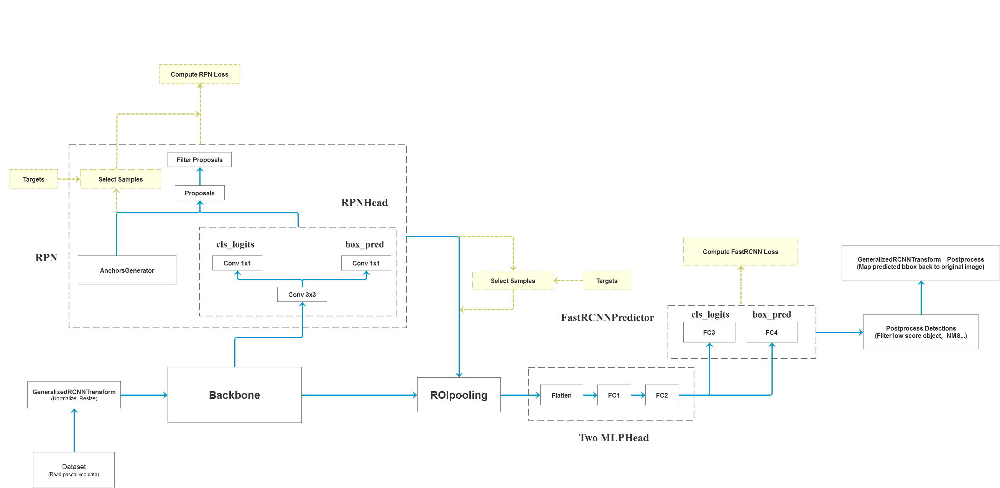

## Faster R-CNN (NeurIPS'15) object detection Tutorial for BYRers

***



### 1. 环境配置

```bash
git clone XXX
conda create -n detection python=3.9
conda activate detection
conda install pytorch torchvision pytorch-cuda=11.8 -c pytorch -c nvidia -y
pip install -r requirements.txt
```

### 2. 下载预训练权重
- [MobileNetV2 weights](https://download.pytorch.org/models/mobilenet_v2-b0353104.pth)，下载后重命名为mobilenet_v2.pth，然后放到pretrained文件夹下；
- [Resnet50 weights](https://download.pytorch.org/models/resnet50-0676ba61.pth)，下载后重命名为resnet50.pth，然后放到pretrained文件夹下；
- [ResNet50+FPN weights](https://download.pytorch.org/models/fasterrcnn_resnet50_fpn_coco-258fb6c6.pth)，下载后重命名为fasterrcnn_resnet50_fpn_coco.pth，然后放到pretrained文件夹下。


### 3. 数据集准备
- VOC2007
```bash
mkdir -p ~/Data/VOC && cd ~/Data/VOC
# Download the training, validation, test data and VOCdevkit
wget http://host.robots.ox.ac.uk/pascal/VOC/voc2007/VOCtrainval_06-Nov-2007.tar
wget http://host.robots.ox.ac.uk/pascal/VOC/voc2007/VOCtest_06-Nov-2007.tar
wget http://host.robots.ox.ac.uk/pascal/VOC/voc2007/VOCdevkit_08-Jun-2007.tar
# Extract all of these tars into one directory named VOCdevkit
tar xvf VOCtrainval_06-Nov-2007.tar
tar xvf VOCtest_06-Nov-2007.tar
tar xvf VOCdevkit_08-Jun-2007.tar
```

- VOC2012
```bash
cd ~/Data/VOC
wget http://host.robots.ox.ac.uk/pascal/VOC/voc2012/VOCtrainval_11-May-2012.tar
tar xvf VOCtrainval_11-May-2012.tar
```

数据基本格式为：
```bash
$VOCdevkit/                           # development kit
$VOCdevkit/VOCcode/                   # VOC utility code
$VOCdevkit/VOC2007                    # image sets, annotations, etc.
$VOCdevkit/VOC2012                    # image sets, annotations, etc.
# ... and several other directories ...
```


### 4. 训练
- 训练mobilenetv2+fasterrcnn：
```bash
CUDA_VISIBLE_DEVICES=1 python train_mobilenetv2.py --data_root ~/Data/VOC --batch_size 16
```
- 训练resnet50+fpn+fasterrcnn:
```bash
CUDA_VISIBLE_DEVICES=2 python train_res50_fpn.py --data_root ~/Data/VOC --batch_size 8
```

### 5. 测试
可以直接下载预训练权重fasterrcnn_voc2012.pth文件进行测试：
- [百度网盘链接](https://pan.baidu.com/s/1NyFwYDOqCn6gcK8gGf-Sgg) 提取码：tovq
- [Google Drive](https://drive.google.com/file/d/1wKWFkA6Zfuk9BvqkdaFOJovPiPk0VtOg/view?usp=drive_link)

也可以使用自己训练的权重进行测试，只需要修改--weights_path参数即可。
```bash
CUDA_VISIBLE_DEVICES=3 python validation.py --data_root ~/Data/VOC --weights_path ./pretrained/fasterrcnn_voc2012.pth
```

可以针对样例图片进行测试：
```bash
CUDA_VISIBLE_DEVICES=3 python predict.py
```

### 6. 注意事项
- 在使用训练脚本时，注意要将--data_root(VOC_root)设置为自己存放VOCdevkit文件夹所在的**根目录**。
- 由于带有FPN结构的Faster RCNN很吃显存，如果GPU的显存不够(如果batch_size小于8的话)建议在create_model函数中使用默认的norm_layer，即不传递norm_layer变量，默认去使用FrozenBatchNorm2d(即不会去更新参数的bn层),使用中发现效果也很好。
- 训练过程中保存的results{%Y%m%d-%H%M%S}.txt是每个epoch在验证集上的COCO指标，前12个值是COCO指标，后面两个值是训练平均损失以及学习率。
- 在使用预测脚本时，要将train_weights设置为你自己生成的权重路径。
- 使用validation文件时，注意确保你的验证集或者测试集中必须包含每个类别的目标，并且使用时只需要修改--num_classes、--data_root和--weights_path即可，其他代码尽量不要改动。

### 6. 参考
- [Faster R-CNN: Towards Real-Time Object Detection with Region Proposal Networks](https://arxiv.org/abs/1506.01497)
- [pytorch/vision/references/detection](https://github.com/pytorch/vision/tree/master/torchvision/models/detection)
- [Custom repo](https://github.com/WZMIAOMIAO/deep-learning-for-image-processing/tree/master/pytorch_object_detection/faster_rcnn)